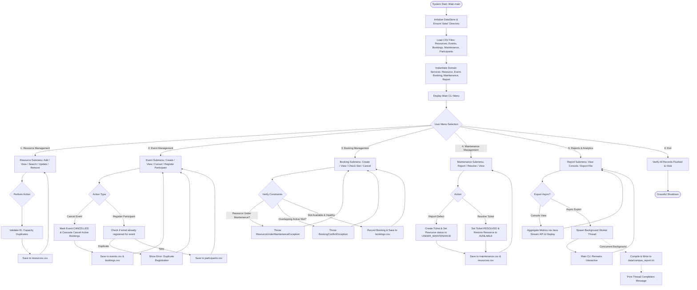

# Activity / Workflow Diagram

This activity diagram illustrates the operational lifecycle of the Campus Resource & Event Management System from startup to shutdown.

```mermaid
flowchart TD
    Start([System Start: Main.main]) --> InitDS[Initialize DataStore & Ensure 'data/' Directory]
    InitDS --> LoadFiles[Load CSV Files: Resources, Events, Bookings, Maintenance, Participants]
    LoadFiles --> InitServices[Instantiate Domain Services: Resource, Event, Booking, Maintenance, Report]
    InitServices --> DisplayMenu[Display Main CLI Menu]

    DisplayMenu --> UserChoice{User Menu Selection}

    %% Option 1
    UserChoice -->|1: Resource Management| ResMenu[Resource Submenu: Add / View / Search / Update / Remove]
    ResMenu --> ResAction{Perform Action}
    ResAction --> ValidateRes[Validate ID, Capacity, Duplicates]
    ValidateRes --> SaveRes[Save to resources.csv]
    SaveRes --> ResMenu

    %% Option 2
    UserChoice -->|2: Event Management| EvtMenu[Event Submenu: Create / View / Cancel / Register Participant]
    EvtMenu --> EvtAction{Action Type}
    EvtAction -->|Cancel Event| CascadeCancel[Mark Event CANCELLED & Cascade Cancel Active Bookings]
    CascadeCancel --> SaveEvt[Save to events.csv & bookings.csv]
    EvtAction -->|Register Participant| CheckEmail[Check if email already registered for event]
    CheckEmail -->|Duplicate| RejectReg[Show Error: Duplicate Registration]
    CheckEmail -->|New| AddReg[Save to participants.csv]
    SaveEvt --> EvtMenu
    RejectReg --> EvtMenu
    AddReg --> EvtMenu

    %% Option 3
    UserChoice -->|3: Booking Management| BookMenu[Booking Submenu: Create / View / Check Slot / Cancel]
    BookMenu --> BookCheck{Verify Constraints}
    BookCheck -->|Resource Under Maintenance?| RejectMnt[Throw ResourceUnderMaintenanceException]
    BookCheck -->|Overlapping Active Slot?| RejectConflict[Throw BookingConflictException]
    BookCheck -->|Slot Available & Healthy| CreateBk[Record Booking & Save to bookings.csv]
    RejectMnt --> BookMenu
    RejectConflict --> BookMenu
    CreateBk --> BookMenu

    %% Option 4
    UserChoice -->|4: Maintenance Management| MntMenu[Maintenance Submenu: Report / Resolve / View]
    MntMenu --> MntAction{Action}
    MntAction -->|Report Defect| MarkMnt[Create Ticket & Set Resource status to UNDER_MAINTENANCE]
    MntAction -->|Resolve Ticket| RestoreAvail[Set Ticket RESOLVED & Restore Resource to AVAILABLE]
    MarkMnt --> SaveMnt[Save to maintenance.csv & resources.csv]
    RestoreAvail --> SaveMnt
    SaveMnt --> MntMenu

    %% Option 5
    UserChoice -->|5: Reports & Analytics| RptMenu[Report Submenu: View Console / Export File]
    RptMenu --> RptAction{Export Async?}
    RptAction -->|Console View| StreamAgg[Aggregate Metrics via Java Stream API & Display]
    RptAction -->|Async Export| SpawnThread[Spawn Background Worker Thread]
    SpawnThread --> MainContinues[Main CLI Remains Interactive]
    SpawnThread -.->|Concurrent Background| WriteReportFile[Compile & Write to data/campus_report.txt]
    WriteReportFile -.-> Notify[Print Thread Completion Message]
    StreamAgg --> RptMenu
    MainContinues --> RptMenu

    %% Option 6
    UserChoice -->|6: Exit| SaveAll[Verify All Records Flushed to Disk]
    SaveAll --> Terminate([Graceful Shutdown])
```
