# Class Diagram

The Class Diagram illustrates the object-oriented structure of the Campus Resource & Event Management System, detailing encapsulation, inheritance, interface implementation, associations, and service layer relationships.

```mermaid
classDiagram
    direction TB

    %% Interfaces and Abstract Classes
    class Bookable {
        <<interface>>
        +getId() String
        +getName() String
        +isAvailable() boolean
        +setStatus(ResourceStatus status) void
    }

    class Resource {
        <<abstract>>
        -id: String
        -name: String
        -type: ResourceType
        -location: String
        -status: ResourceStatus
        -capacity: int
        +getSpecificDetails()* String
        +isAvailable() boolean
        +toString() String
    }

    Bookable <|.. Resource : implements

    %% Concrete Subclasses (Inheritance / Polymorphism)
    class Room {
        -hasProjector: boolean
        -hasAirConditioning: boolean
        +getSpecificDetails() String
    }

    class Laboratory {
        -workstationsCount: int
        -softwareConfig: String
        +getSpecificDetails() String
    }

    class Equipment {
        -specifications: String
        -portable: boolean
        +getSpecificDetails() String
    }

    Resource <|-- Room : extends
    Resource <|-- Laboratory : extends
    Resource <|-- Equipment : extends

    %% Domain Models
    class Event {
        -id: String
        -title: String
        -organizer: String
        -startDateTime: LocalDateTime
        -endDateTime: LocalDateTime
        -status: EventStatus
        -expectedAttendees: int
        -participants: List~Participant~
        +addParticipant(Participant) boolean
        +isCancelled() boolean
    }

    class Participant {
        -participantId: String
        -eventId: String
        -name: String
        -email: String
        -department: String
        -registeredDate: LocalDateTime
    }

    class Booking {
        -id: String
        -resourceId: String
        -eventId: String
        -purpose: String
        -startDateTime: LocalDateTime
        -endDateTime: LocalDateTime
        -bookedBy: String
        -status: BookingStatus
        +isActive() boolean
    }

    class MaintenanceRecord {
        -id: String
        -resourceId: String
        -issueDescription: String
        -reportedDate: LocalDate
        -resolvedDate: LocalDate
        -status: MaintenanceStatus
        -reportedBy: String
        +isPendingOrInProgress() boolean
    }

    Event "1" *-- "*" Participant : registers
    Booking "0..*" --> "1" Resource : reserves
    Booking "0..*" --> "0..1" Event : associates with
    MaintenanceRecord "0..*" --> "1" Resource : inspects

    %% Services & Storage
    class DataStore {
        -dataDirectory: String
        -resources: Map~String, Resource~
        -events: Map~String, Event~
        -bookings: Map~String, Booking~
        -maintenanceRecords: List~MaintenanceRecord~
        -participants: List~Participant~
        +loadAllData() void
        +saveResources() void
        +saveEvents() void
        +saveBookings() void
        +saveMaintenance() void
        +saveParticipants() void
    }

    class ResourceService {
        -dataStore: DataStore
        +addResource(Resource) void
        +getAllResources() List~Resource~
        +searchResources(String) List~Resource~
        +updateResource(String, String, String, int) boolean
        +removeResource(String) boolean
    }

    class BookingService {
        -dataStore: DataStore
        +createBooking(String, String, String, LocalDateTime, LocalDateTime, String) Booking
        +isResourceAvailable(String, LocalDateTime, LocalDateTime) boolean
        +findConflictingBooking(String, LocalDateTime, LocalDateTime) Booking
        +cancelBooking(String) boolean
    }

    class EventService {
        -dataStore: DataStore
        +createEvent(Event) void
        +cancelEvent(String) boolean
        +registerParticipant(String, String, String, String) void
        +getUpcomingEvents() List~Event~
    }

    class MaintenanceService {
        -dataStore: DataStore
        +reportIssue(String, String, String) MaintenanceRecord
        +updateMaintenanceStatus(String, MaintenanceStatus, LocalDate) boolean
        +getPendingRecords() List~MaintenanceRecord~
    }

    class ReportService {
        -dataStore: DataStore
        +generateFullReport() String
        +exportReportSync(String) void
        +exportReportAsync(String, Consumer, Consumer) Thread
    }

    ResourceService --> DataStore
    BookingService --> DataStore
    EventService --> DataStore
    MaintenanceService --> DataStore
    ReportService --> DataStore
```

