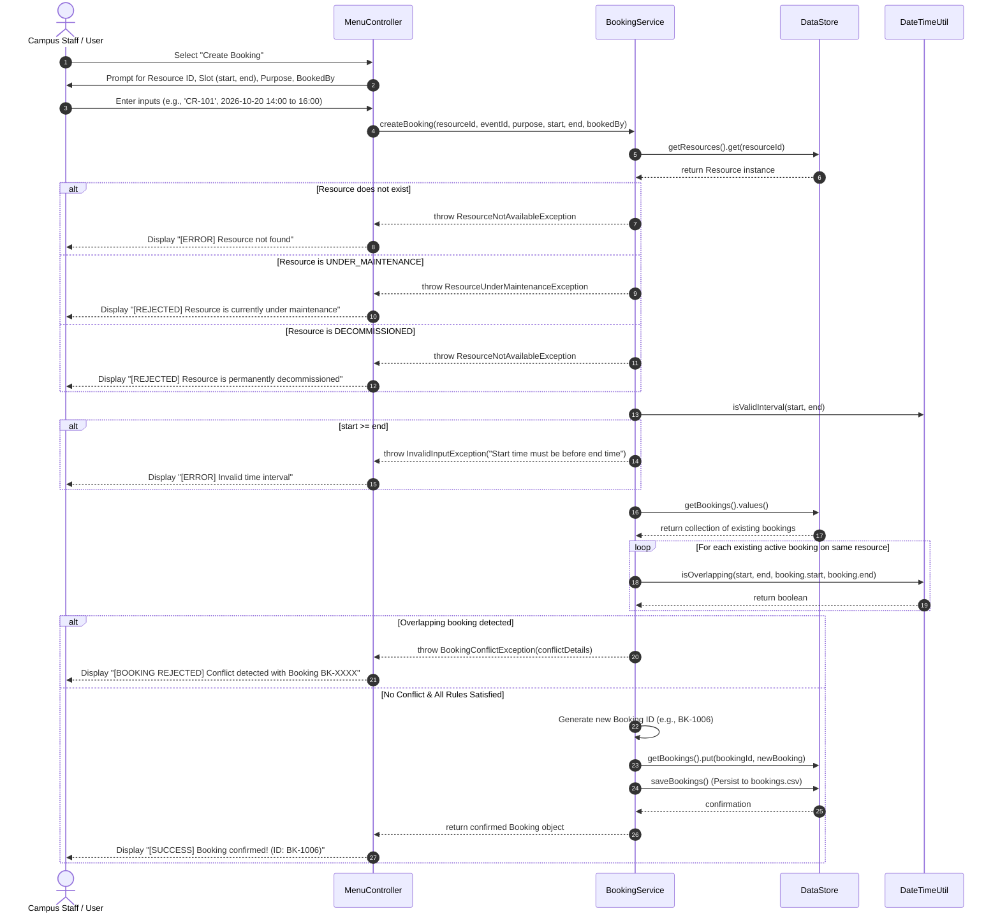

# Sequence Diagram: Resource Booking Flow

This sequence diagram depicts the detailed method execution flow and decision points when a user requests to book a campus resource.

```mermaid
sequenceDiagram
    autonumber
    actor User as Campus Staff / User
    participant UI as MenuController
    participant BS as BookingService
    participant DS as DataStore
    participant UTIL as DateTimeUtil

    User->>UI: Select "Create Booking"
    UI->>User: Prompt for Resource ID, Slot (start, end), Purpose, BookedBy
    User->>UI: Enter inputs (e.g., 'CR-101', 2026-10-20 14:00 to 16:00)

    UI->>BS: createBooking(resourceId, eventId, purpose, start, end, bookedBy)

    BS->>DS: getResources().get(resourceId)
    DS-->>BS: return Resource instance

    alt Resource does not exist
        BS-->>UI: throw ResourceNotAvailableException
        UI-->>User: Display "[ERROR] Resource not found"
    else Resource is UNDER_MAINTENANCE
        BS-->>UI: throw ResourceUnderMaintenanceException
        UI-->>User: Display "[REJECTED] Resource is currently under maintenance"
    else Resource is DECOMMISSIONED
        BS-->>UI: throw ResourceNotAvailableException
        UI-->>User: Display "[REJECTED] Resource is permanently decommissioned"
    end

    BS->>UTIL: isValidInterval(start, end)
    alt start >= end
        BS-->>UI: throw InvalidInputException("Start time must be before end time")
        UI-->>User: Display "[ERROR] Invalid time interval"
    end

    BS->>DS: getBookings().values()
    DS-->>BS: return collection of existing bookings

    loop For each existing active booking on same resource
        BS->>UTIL: isOverlapping(start, end, booking.start, booking.end)
        UTIL-->>BS: return boolean
    end

    alt Overlapping booking detected
        BS-->>UI: throw BookingConflictException(conflictDetails)
        UI-->>User: Display "[BOOKING REJECTED] Conflict detected with Booking BK-XXXX"
    else No Conflict & All Rules Satisfied
        BS->>BS: Generate new Booking ID (e.g., BK-1006)
        BS->>DS: getBookings().put(bookingId, newBooking)
        BS->>DS: saveBookings() (Persist to bookings.csv)
        DS-->>BS: confirmation
        BS-->>UI: return confirmed Booking object
        UI-->>User: Display "[SUCCESS] Booking confirmed! (ID: BK-1006)"
    end
```
