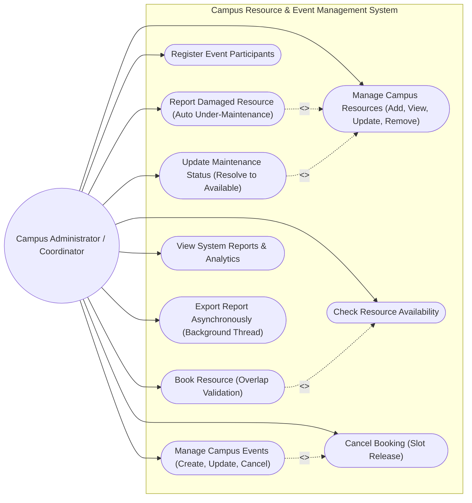

# Use Case Diagram

The Use Case Diagram illustrates the functional interactions between the Campus Administrator / Staff and the Campus Resource & Event Management System.

### Use Case Descriptions
* **UC-1: Manage Campus Resources**: Administrative staff can add classrooms, computer labs, seminar halls, or portable equipment with specific metadata.
* **UC-2 & UC-3: Event Planning & Participant Registration**: Coordinators schedule events and register students with automated duplicate email prevention.
* **UC-5: Book Resource**: Checks time overlap against existing bookings and rejects if the resource is in maintenance.
* **UC-6: Cancel Booking**: Releases the time slot. Cancelling an event also automatically triggers this use case.
* **UC-7 & UC-8: Maintenance Lifecycle**: Reporting a defect automatically transitions the resource to `UNDER_MAINTENANCE`, preventing any booking until marked `RESOLVED`.
* **UC-10: Asynchronous Export**: Dispatches report compilation to a background thread to prevent UI lockup.
